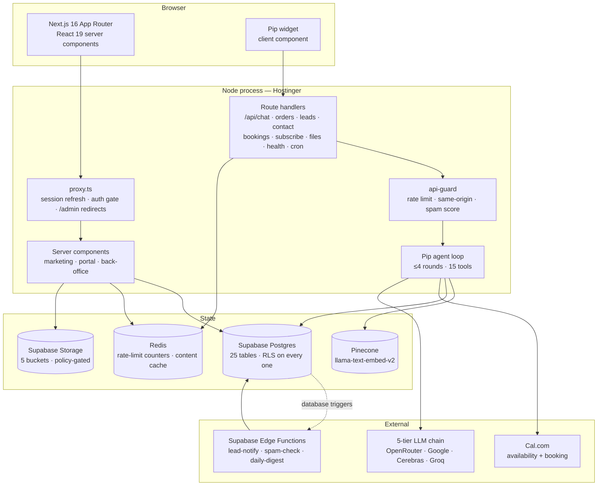
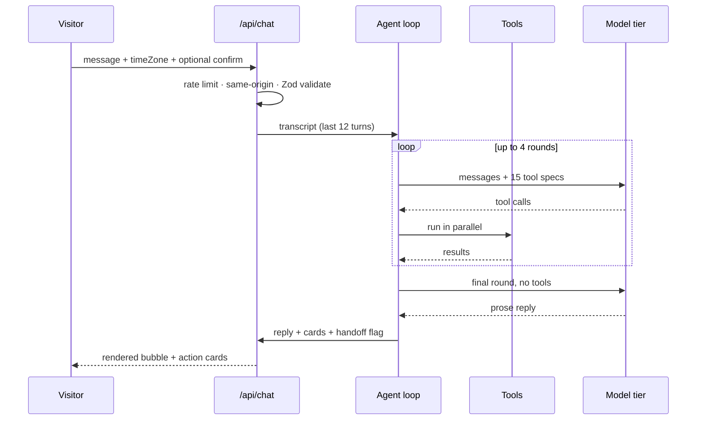

<div align="center">

# Office Pigeon

**A production SaaS platform, an agentic RAG assistant, and the business that runs on both.**

[**officepigeon.com**](https://officepigeon.com) · [Services](https://officepigeon.com/pricing) · [Academy](https://officepigeon.com/academy) · [Talk to Pip](https://officepigeon.com)

[](https://nextjs.org)
[](https://react.dev)
[](https://www.typescriptlang.org)
[](https://supabase.com)
[](https://www.pinecone.io)
[](https://redis.io)
[](https://github.com/mAbdullahCheema/Office-Pigeon/actions/workflows/ci.yml)

</div>

---

## What this is

Office Pigeon sells four things — websites, chatbots, AI calling agents and automation workflows — plus an online academy and four SaaS products in build. This repository is the whole company: the marketing site that sells it, the customer portal that delivers it, the staff back-office that runs it, and **Pip**, an agentic assistant with fifteen tools that answers questions, quotes real prices, books calls on a real calendar, places real orders and hands over to a human when it should.

It is not a demo. Every price Pip quotes is read from the same Postgres rows the pricing table renders from. Every booking it offers is a live Cal.com slot. Every order it places lands in a staff dashboard with an audit trail behind it.

Pip is behind sign-in. Its tools read a viewer's own account, invoices and payment details and can place an order against them, so the conversation is tied to a real user row rather than an anonymous session — and the row level security that governs a dashboard read governs a tool call identically. The cost is real and stated in [Decisions](#decisions-and-tradeoffs): a first-time visitor asking "how much is a chatbot" has to sign in first. The widget shows anonymous visitors the phone, WhatsApp, email and booking links instead of a dead box.

**Why it is worth reading as an engineering artefact:**

- One codebase covers a public marketing site, a multi-tenant customer portal, a role-gated staff back-office and an LLM agent — with no separate admin app and no duplicated data layer.
- Authorisation is enforced in Postgres with row level security, not in application code. A bug in a React component cannot leak another customer's invoice.
- The assistant degrades on five separate axes — model provider, retrieval, calendar, cache, database — and stays useful when any of them is down.
- Nothing the model asks for that touches money, a calendar or someone's inbox happens without a human tapping a button first.
- Every non-obvious decision below has a stated tradeoff. Several of them are measured, not assumed.

---

## Table of contents

- [Live surface](#live-surface)
- [Architecture](#architecture)
- [Pip — the agentic RAG assistant](#pip--the-agentic-rag-assistant)
- [The platform](#the-platform)
- [Data model and authorisation](#data-model-and-authorisation)
- [Reliability and degradation](#reliability-and-degradation)
- [Security](#security)
- [Performance](#performance)
- [SEO, GEO and AEO](#seo-geo-and-aeo)
- [Observability](#observability)
- [Decisions and tradeoffs](#decisions-and-tradeoffs)
- [Running it locally](#running-it-locally)
- [Deployment](#deployment)
- [Project layout](#project-layout)
- [Commands](#commands)

---

## Live surface

| Area | Routes | What it does |
| --- | --- | --- |
| **Marketing** | `/`, `/websites`, `/chatbots`, `/calling-agents`, `/automations`, `/pricing`, `/examples`, `/faq`, `/contact` | Publishes the catalogue with every price in the open. Content is editable from the back-office without a deploy. |
| **Academy** | `/academy`, `/academy/courses`, `/academy/courses/[slug]` | School tutoring plus a professional track. Courses are data, so a new course is a row, not a page. |
| **Products** | `/products`, `/products/[product]` | Four SaaS products in build, each with its own marketing page and waiting list. |
| **Apps** | `/apps/whiteboard` | A working canvas app that runs inside the site. |
| **Ordering** | `/order` | A multi-step order flow that writes a real order and notifies staff. |
| **Customer portal** | `/dashboard`, `/dashboard/orders`, `/billing`, `/files`, `/messages`, `/classes` | Orders, invoices, payment submission, deliverable downloads, a message thread with the team. |
| **Staff back-office** | `/dashboard/manage/*` | Catalogue, content, media, people, payment review, audit log — role-gated to `owner`, `admin`, `editor`. |
| **Assistant** | `/api/chat` + widget on every page | Pip. Signed-in visitors chat; anonymous ones get the human channels. |
| **Machine surface** | `/sitemap.xml`, `/robots.txt`, `/llms.txt`, `/opengraph-image`, `/manifest.webmanifest`, `/api/health` | Everything a crawler, an answer engine, a social card renderer or a load balancer asks for. |

---

## Architecture



### The shape of it

**Rendering.** React 19 server components do the reading. A marketing page is a server component that awaits its content and returns HTML; there is no client-side data fetching on the public site at all. Client components exist only where interaction demands them — the chat widget, the cookie banner, the order stepper, the whiteboard canvas.

**No CSS framework.** The design language is carried by `components/ui/Fx.tsx`, which takes a CSS declaration string, deduplicates it into a generated class and emits the rule once. The tradeoff is deliberate and stated in [Decisions](#decisions-and-tradeoffs).

**One dashboard, two audiences.** There is no separate admin application. `/dashboard` renders a customer's own orders or a staff member's queue depending on what the session's role permits, and the staff sections live under `/dashboard/manage`. One layout, one nav, one auth path, one set of components — and no second app to keep in step.

**The data layer is one module deep.** `lib/site-content.ts` is the only thing that reads published content, and it is also the naming boundary: Postgres is `snake_case`, components speak `camelCase`, and the mapping happens in exactly one file. A column rename never reaches a component.

---

## Pip — the agentic RAG assistant

Pip is the part of this repository that most repays reading. It is a tool-calling agent, not a chat wrapper: it retrieves, it acts, and it knows what it is not allowed to do on its own.

### The loop



Four rounds is the ceiling. A question that genuinely needs more than a search, a price list and a calendar read is a question for a person, and the loop ends by saying exactly that.

### The fifteen tools

| Tool | Reads | Writes | Notes |
| --- | --- | --- | --- |
| `search_knowledge` | Pinecone | — | Semantic search over the indexed site |
| `get_pricing` | Postgres | — | The live catalogue, not a copy in the prompt |
| `get_faqs` | Postgres | — | Published answers only |
| `list_academy_classes` | Postgres | — | Subject, level, tutor, schedule |
| `list_consultation_slots` | Cal.com | — | Real availability, in the visitor's timezone |
| `get_my_account` | Postgres | — | Signed-in visitors only, own rows only |
| `get_payment_details` | Postgres | — | Signed-in visitors only |
| `show_pages` | — | — | Renders link cards |
| `book_consultation` | Cal.com | Cal.com | **Gated on a tap** |
| `place_order` | Postgres | Postgres | **Gated on a tap** |
| `cancel_consultation` | Cal.com | Cal.com | **Gated on a tap** |
| `capture_lead` | — | Postgres | Notifies staff |
| `message_team` | — | Postgres | Opens a thread |
| `subscribe_to_updates` | — | Postgres | |
| `update_my_details` | — | Postgres | Own profile only |
| `request_human` | — | Postgres | Ends the conversation, hands to a person |

### Nothing is written without a tap

This is the single most important design decision in the agent, and it is enforced on the server.

When the model calls `book_consultation`, `place_order` or `cancel_consultation`, the server does **not** perform the action. It returns a `confirm` card describing precisely what would happen — the slot, the item, the plan, the price. The action runs only when the next request from the browser carries a matching `confirm` payload, which only a tap on that card can produce.

The consequence is that a prompt injection in a retrieved document, a hallucinated argument, or a model that misreads the conversation cannot book, buy or cancel anything. The worst it can do is show a card the visitor declines. Capability and authority are separated at the transport layer, not by asking the model nicely in a system prompt.

### The provider chain

Five tiers, tried strictly in order, every one of them tool-capable:

| Tier | Provider | Why it is in the list |
| --- | --- | --- |
| 1 | OpenRouter · DeepSeek v4 Flash | Fast, cheap, long context |
| 2 | Google AI Studio · Gemini 3.6 Flash | A different company, not just a different route |
| 3 | OpenRouter · free model | Covers OpenRouter credit running out |
| 4 | Cerebras · gpt-oss-120b | Very fast, free tier |
| 5 | Groq · gpt-oss-120b | Last resort, a different network path again |

A tier with no key is skipped rather than attempted; a tier that errors hands on to the next. Two findings in here are measured rather than assumed, and both are recorded in the code:

- `gemini-3.7-flash` and `gemini-flash-latest` were returning 503s and taking 40–70 seconds while `gemini-3.6-flash` answered in about two. The model is pinned deliberately, with the measurement written next to the pin.
- The Gemini tier is marked `skipAfterToolCalls`, because its OpenAI-compatible layer rejects a conversation containing another provider's tool calls — it wants a `thought_signature` nothing else emits. It still answers the first round perfectly well, which is most turns, so it stays in the chain rather than being dropped.

The chain also guards output quality, not just availability: a tier whose reply leaks raw tool-call markup is failed and the next one is tried, and the final reply is stripped of markdown the plain-text bubble cannot render.

### Knowledge

`npm run kb:index` rebuilds the Pinecone namespace from the live database — the same rows the pages render. Pip therefore cannot quote a price the site does not sell.

Two details make it safe to re-run:

- The existing namespace is written to `page-backups/` before it is replaced. A knowledge base holding two generations of contradictory copy is worse than an empty one.
- Pip's own behaviour rules are deliberately **not** indexed. They live in `lib/pip/prompt.ts`, where they cannot be retrieved into a reply and quoted back at a visitor who asks the assistant to describe its instructions.

The Pinecone index carries its own embedding model (`llama-text-embed-v2`), so text goes in and text comes out. There is no separate embedding provider to key, to bill, or to keep in version lockstep with the index.

### When Pip cannot answer

With no provider key, or with `PIP_ENABLED=false`, the widget still loads and still offers the phone, WhatsApp, email and booking links. It says so rather than pretending to think. A failed reply mid-conversation returns the same fallback card. **There is no state in which the visitor is left with a dead widget and no way to reach a person.**

---

## The platform

### Ordering and payment

An order moves through a state machine (`lib/order-status.ts`) with a matching payment status. Payment is by bank transfer or wallet with a screenshot as proof: the customer uploads it into a **private** Storage bucket, staff review it in the dashboard, and approval flips the invoice. No card processor is integrated, which is a deliberate scope decision for the markets this serves — and it means the repository holds no cardholder data and inherits no PCI surface.

### Messaging without an email provider

There is no transactional email provider, on purpose. The app's own alerts — a new lead, a payment submitted, the daily digest — are rows in `public.notifications`, streamed into the dashboard over Supabase Realtime. Registration creates a confirmed account and signs straight in; a locked-out customer is recovered by an owner from **People → Customers → Set a new password**.

The tradeoff is explicit: no sending domain to warm, no deliverability to monitor, no API key to rotate, and no third party holding customer email — at the cost of not being able to reach a customer who never comes back to the site. For a business where the same customer is already in a WhatsApp thread, that trade is worth making.

### Edge functions

Three Deno functions run on Supabase, invoked by database triggers rather than by the app:

| Function | Trigger | Job |
| --- | --- | --- |
| `lead-notify` | New row in `leads` | Raise a staff notification |
| `spam-check` | New `contact_messages` row | Score it and flag it |
| `daily-digest` | Scheduled | Summarise the day into `notifications` |

`lib/spam.ts` is dependency-free specifically so the identical scoring logic can run inside the edge function and inside the Node app without being written twice.

---

## Data model and authorisation

Twenty-five tables, twenty-two enums, and **row level security on every table**.

Authorisation lives in Postgres. The role helpers were deliberately moved into a `private` schema (migration `20260823185916`) so they are not exposed on the public API surface, and policies call them rather than re-deriving roles per policy. Storage buckets carry their own policies: `media` and `avatars` are publicly readable because they render on public pages; `proofs`, `attachments` and `documents` are private, because a payment proof shows somebody's bank account.

**Why this matters more than it sounds.** The app has three privileged paths — server components, route handlers and the Pip agent. If authorisation lived in application code, each of those would need its own correct copy of every rule, and the agent's would be the one written last and reviewed least. Because the rules live in the database, a Pip tool asking for an order it should not see gets zero rows, and it gets zero rows for the same reason a React component would.

The service key that bypasses RLS is used in exactly the places that must — the health probe, the keep-alive read, and the content loaders that render public pages — and it is guarded by `server-only` so an accidental import into a client component fails the build rather than shipping the key to a browser.

---

## Reliability and degradation

The design goal is that no single dependency being down takes the site with it.

| Dependency | If it fails |
| --- | --- |
| **Postgres** | The only hard dependency. `/api/health` returns 503 so a load balancer removes the instance. Public pages still render from shipped defaults. |
| **Redis** | Rate limiting and content caching fall back to per-process state. Deliberately **not** fail-open: one instance still gets a real limit, it just cannot see its siblings' traffic. |
| **Pinecone** | Pip answers from its structured tools — pricing, FAQs, classes — without semantic search. |
| **Cal.com** | Pip offers the public booking page instead of in-chat slots. |
| **Any LLM tier** | The next tier answers. All five down, and the widget hands over the human channels. |
| **Supabase content tables** | Every getter falls back to the shipped defaults in `lib/content-defaults.ts`, so the site renders correctly during a re-seed. |

Two specific pieces of hard-won reliability engineering are worth calling out:

**Transient JWT skew.** Supabase's gateway occasionally mints a token whose `iat` is marginally in the future, and PostgREST rejects it with `JWT issued at future`. The content loader retries with backoff at 150 ms, 450 ms and 900 ms — delays chosen against the skew windows actually observed in the logs, not picked round. A failure is never written to the cache, so a one-second blip cannot pin the site to default content for the rest of the five-minute TTL.

**Keep-alive.** A free-tier Supabase project pauses after seven days of inactivity, which would take the site down until a human noticed. `.github/workflows/keepalive.yml` calls `POST /api/cron/keepalive` on a `*/5` day schedule — a maximum five-day gap in any month — and the endpoint does one authenticated row read. It is an HTTPS request through the API gateway rather than a `pg_cron` job precisely because activity inside the database is not obviously activity from the platform's point of view. As a side effect, a failing keep-alive is an early warning that production is down.

---

## Security

| Control | Implementation |
| --- | --- |
| **Row level security** | Every table. Role helpers in a `private` schema. |
| **Content Security Policy** | `default-src 'self'`, `object-src 'none'`, no third-party `script-src`. `connect-src` is *derived from configured env vars*, so an unconfigured deployment ships the tighter policy. |
| **Security headers** | HSTS with preload, `X-Content-Type-Options`, `X-Frame-Options`, `Referrer-Policy`, `Permissions-Policy`, `Cross-Origin-Opener-Policy`. `poweredByHeader` off. |
| **Rate limiting** | Named per-route budgets, Redis-backed, enforced by an atomic Lua script — one round trip instead of three, which removed ~200 ms from every guarded request. |
| **CSRF** | Cross-origin form posts rejected by `Origin` check on every write route. |
| **Spam** | Heuristic scoring on public forms, plus an edge function on write. |
| **Input validation** | Zod at every route boundary. |
| **Secrets** | `server-only` guard on every module touching the service key. No secret is ever `NEXT_PUBLIC_`. |
| **Timing safety** | The cron endpoint compares its bearer token with `timingSafeEqual`, and compares lengths first so a mismatch cannot leak the secret's length. |
| **Private routes** | `/dashboard/*` carries `X-Robots-Tag: noindex` and `Cache-Control: private, no-store`. `/api/*` is `no-store`. |
| **Prompt injection** | The agent's write tools are gated on a human tap. Retrieved documents cannot cause a side effect. |
| **Error opacity** | Health and cron failures log the reason to the host and return a generic body — the response never describes the backend to whoever asked. |

### Consent, honestly implemented

The cookie banner is not decorative. Nothing optional loads until the visitor chooses: PostHog is not initialised, not merely opted-out. Switching analytics off later stops capture immediately and purges PostHog's `ph_*` cookies and localStorage keys by prefix. **Global Privacy Control and `DNT: 1` are treated as a hard override**, not as a default the visitor can be nudged past. Session replay is off, because it would record what people type into the contact and order forms.

---

## Performance

- **Standalone output.** `next build` emits a self-contained server bundle, so the host does not need `node_modules` at runtime.
- **Responsive images.** `scripts/build-assets.mjs` generates 70 responsive variants; `ImageSlot` emits `srcset`, intrinsic dimensions and `sizes`. Measured **~83% mobile data saving** on image payload.
- **Shared content cache.** Published content is read through Redis with a five-minute TTL and purged the moment a staff edit lands, so an editor never sees stale copy they just changed.
- **One round trip for rate limiting.** See the Lua script above.
- **Fonts.** `next/font` self-hosts Bricolage Grotesque and Plus Jakarta Sans with `display: swap` — no external font request, which is also what lets `font-src` stay `'self'`.
- **No CSS framework payload.** Styles are generated and deduplicated at render.
- **Analytics is a dynamic import.** `posthog-js` is 261 KB uncompressed and sits in its own chunk, fetched only after a visitor accepts the analytics category. Importing it statically and merely skipping `init` would have shipped it to everyone — including the majority who decline — which is both slower and a broken promise, since the banner says nothing optional loads until you choose.

---

## SEO, GEO and AEO

Three different audiences, addressed separately.

**Search engines (SEO).** Every public route carries canonical URL, Open Graph and Twitter card metadata through one helper, `lib/seo.ts` — which exists because writing them per page is exactly how one page ends up without a canonical. Social cards are generated at the edge by `next/og`. Sitemap and robots are generated from the route table, so a new route cannot be forgotten.

**Answer engines (AEO).** `lib/schema.ts` emits one JSON-LD `@graph` per page rather than disconnected blocks, with `Organization` and `WebSite` declared once on the homepage and referenced by `@id` everywhere else — which is what lets a crawler merge the site into a single entity. Coverage: `Organization`, `WebSite`, `WebPage`/`FAQPage`/`ContactPage`/`CollectionPage`, `BreadcrumbList`, `Service`, `SoftwareApplication`, `Course`, `EducationalOrganization`, `OfferCatalog`, `AggregateOffer`.

Every price in that graph is read from `lib/catalog.ts` — the same module the pricing table renders from — so the structured data and the visible page cannot drift apart. Products still in build are marked `PreOrder`, not `InStock`, because claiming stock for something nobody can buy is both a rich-result violation and untrue.

**Generative engines (GEO).** [`/llms.txt`](https://officepigeon.com/llms.txt) gives a language model the whole business in one fetch: what it sells, what each thing costs, how the pricing works, and where to look next — generated from the catalogue, so it cannot go stale. `robots.ts` names the assistant crawlers explicitly rather than leaving them to the wildcard: the intent is that being the source ChatGPT, Claude, Perplexity and Google's AI answers quote is *the point*, and naming them is what stops a future "block the AI crawlers" edit from silently costing every citation.

---

## Observability

Both integrations are keyed off an environment variable and do nothing at all without it, so the site runs identically with neither configured.

**Sentry** — server, edge and browser. Errors that React swallows into a digest are caught through Next's `onRequestError` hook, which is the only place they surface. `tracesSampleRate` is 0.1 because the free tier is a fixed monthly quota and at 100% a single crawler run can exhaust the month and leave a real outage unreported. Source maps upload only when an auth token is present, so a build without one succeeds with minified traces rather than failing. The build plugin is only applied when a DSN exists — a deployment without Sentry cannot have its build broken by Sentry.

**PostHog** — product analytics, gated on consent as described above, loaded as a dynamic import so declining costs the visitor nothing, with every runtime-fetched bundle disabled so the strict CSP never has to be loosened for it.

**Health** — `/api/health` reports database and cache separately, and only Postgres decides the status code. A non-200 must mean "this instance cannot serve", not "something is imperfect", or a load balancer will drain a fleet that was working.

---

## Decisions and tradeoffs

Each of these was a fork in the road. The cost of each is stated, not hidden.

**Postgres RLS instead of application-layer authorisation.**
*Gained:* one place to get authorisation right, enforced identically for server components, route handlers and the AI agent.
*Cost:* policies are harder to unit-test than functions, and a policy mistake is a migration rather than a patch. Worth it — the agent is the path most likely to be exercised in unexpected ways, and it is the path that benefits most.

**No CSS framework.**
*Gained:* no framework payload, no build-time purge step, styling that travels with the component.
*Cost:* no ecosystem of pre-built components, and a new contributor has to learn `Fx` before they can style anything. It also forces `style-src 'unsafe-inline'` in the CSP.

**No transactional email provider.**
*Gained:* no sending domain, no deliverability work, no key to rotate, no third party holding customer email.
*Cost:* no way to reach a customer who never returns to the site. Acceptable where the same customer is already reachable on WhatsApp.

**Five LLM providers instead of one good one.**
*Gained:* the assistant survives a quota exhaustion, a regional outage and a refused project without a deploy.
*Cost:* every tier must be tool-capable and quirk-compatible, which is real ongoing work — the Gemini `thought_signature` incompatibility is exactly the tax this design charges.

**Human-tap confirmation on every write tool.**
*Gained:* prompt injection and hallucination cannot cause a side effect. Ever.
*Cost:* one extra tap in every booking and order flow, and a slightly longer conversation. For actions involving money and calendars, the friction is the feature.

**Pip behind sign-in.**
*Gained:* every tool call is executed as a known user, so RLS governs the agent exactly as it governs a page, and `get_my_account`, `get_payment_details` and `place_order` are safe to expose at all.
*Cost:* friction at the top of the funnel — the visitor most likely to ask Pip a pricing question is the one who has not signed up. The honest alternative is a second, anonymous tool set with no account access; that is a real piece of work and it has not been done.

**Redis optional rather than required.**
*Gained:* the app runs on one instance with no cache infrastructure at all.
*Cost:* two code paths for rate limiting and caching, both of which have to stay correct.

**Bank transfer and wallet instead of a card processor.**
*Gained:* no PCI surface, no cardholder data in the repository, and it matches how the target market actually pays.
*Cost:* a manual review step per payment, and no self-serve checkout.

**GitHub Actions for keep-alive instead of `pg_cron`.**
*Gained:* activity the platform can unambiguously see, versioned in the repository, and an early-warning signal when production is unreachable.
*Cost:* GitHub disables scheduled workflows in a repository idle for 60 days. Documented, and the deployment guide carries a Hostinger cron one-liner as a second trigger.

**Standalone Node output on shared hosting instead of a serverless platform.**
*Gained:* full Node runtime, long-lived Redis connections, predictable cost, no cold starts.
*Cost:* no automatic edge distribution, and scaling is manual.

---

## Running it locally

**Prerequisites:** Node 20+ (22 recommended), a Supabase project, and — optionally — Pinecone, Cal.com, Redis and one LLM provider key.

```bash
git clone https://github.com/mAbdullahCheema/Office-Pigeon.git
cd Office-Pigeon
npm install
cp .env.example .env.local   # then fill it in
```

`.env.example` documents every variable, including which ones are optional and what happens when they are absent. Nothing in it is a secret.

Apply the schema, seed the catalogue, create the first owner, then run it:

```bash
npx supabase link --project-ref <your-ref>
npx supabase db push
npm run db:seed
npm run db:create-admin
npm run dev
```

Prove it works end to end:

```bash
npm run test:e2e    # database, storage, auth, rate limiting, health
npm run test:pip    # the agent: tools, provider failover, confirmations
```

---

## Deployment

The app is built as a standalone Node bundle and runs as a plain Node process. **[`DEPLOYMENT.md`](DEPLOYMENT.md) is the complete, step-by-step guide for Hostinger Business hosting** — Node app setup, environment variables, domain and SSL, the keep-alive cron, and what to check after go-live.

The short version:

```bash
npm run build
npm run package:hostinger   # produces deploy/
```

Upload the contents of `deploy/`, set the startup file to `server.js`, add the environment variables, and start it.

---

## Project layout

```
app/
  (site)/            marketing, academy, products, order, portal, back-office
  api/               chat · orders · leads · contact · bookings · subscribe
                     files · auth · health · cron/keepalive
  llms.txt/          the machine-readable business summary
  opengraph-image    generated social cards
  sitemap.ts robots.ts manifest.ts
components/
  site/              page views, nav, footer, Pip widget, cookie banner
  ui/                Fx, ImageSlot, Reveal, JsonLd, BackToTop, EmptyPanel
lib/
  pip/               agent · providers · tools · prompt · knowledge · calcom
  supabase/          server · client · admin · service · storage · proxy
  schema.ts seo.ts   structured data and page metadata
  consent.ts         the one reader of the cookie decision
  rate-limit.ts redis.ts redis-scripts.ts cache.ts
  catalog.ts courses.ts content-defaults.ts page-content.ts site-content.ts
supabase/
  migrations/        schema, RLS, storage policies, realtime, triggers
  functions/         lead-notify · spam-check · daily-digest
scripts/
  seed · create-admin · status · index-knowledge · e2e · e2e-pip
  build-assets · package-hostinger
.github/workflows/   ci · keepalive
proxy.ts             session refresh, auth gate, legacy redirects
```

---

## Commands

| Command | What it does |
| --- | --- |
| `npm run dev` | Development server |
| `npm run build` | Production build (standalone) |
| `npm run start` | Run the production build |
| `npm run typecheck` | `tsc --noEmit` |
| `npm run lint` | ESLint |
| `npm run assets` | Generate icons and responsive image variants |
| `npm run package:hostinger` | Build the upload folder in `deploy/` |
| `npm run db:seed` | Seed the catalogue and content |
| `npm run db:create-admin` | Create the first owner account |
| `npm run db:status` | Report what is in the database |
| `npm run db:types` | Regenerate TypeScript types from Postgres |
| `npm run kb:index` | Rebuild Pip's Pinecone knowledge base |
| `npm run test:e2e` | End-to-end platform check |
| `npm run test:pip` | End-to-end agent check |

---

## Licence and use

This repository is published as a portfolio artefact and as the source of a running business. The code is readable; the brand, copy, images and customer data are not licensed for reuse.

---

<div align="center">

**Built by [Muhammad Abdullah Cheema](https://github.com/mAbdullahCheema)**

[officepigeon.com](https://officepigeon.com) · [help@officepigeon.com](mailto:help@officepigeon.com)

</div>
